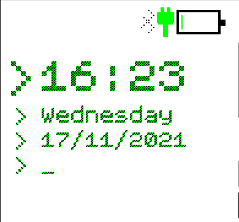

# Cli Clock

A retro VT100 command line style clock made by the Espruino and enhanced by me for the Bangle JS 2!

## Changes made
* Made the time line font bigger and changed margin spacing to minimize any wasted screen space

## Screenshots
### Normal face

## Future Enhancements
* Remove the extra 'bumf' like the heart rate stuff, batter info, ect. No easy way to control them and kinda unnecessary 
* Maybe add some extra lines showing more data? Maybe a "> Playing *MusicPlayingHere*"
